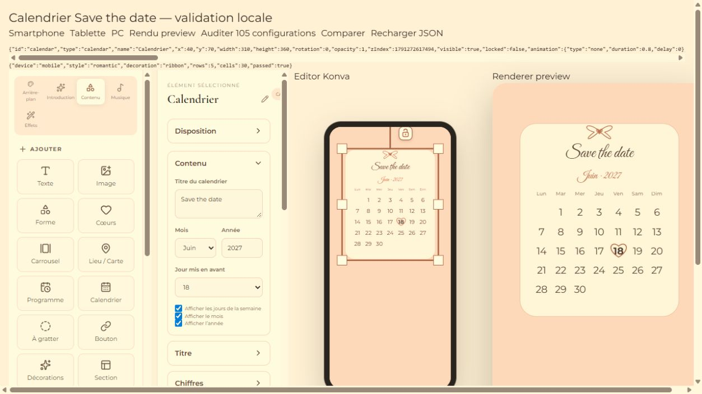
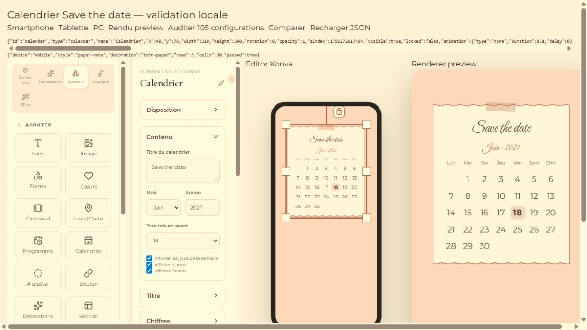

# Élément Calendrier — 6 octobre 2026

## Résultat

Calendrier est disponible dans Contenu > Ajouter. Il utilise le type générique `calendar` et les mécanismes existants de sélection, déplacement, resize, rotation, verrouillage, visibilité par support, duplication, suppression, renommage et insertion dans une Section.

Le panneau comporte, dans l'ordre : Disposition, Contenu, Titre, Chiffres, Décoration, Apparence, Animation. Les états repliés/dépliés utilisent le store UI partagé par identifiant logique de catégorie, sans nouveaux états dans le projet.

## Données

`CalendarElement extends BaseElement` :

```ts
{
  type: "calendar",
  title, month, year, highlightedDay: number | null,
  style: "minimal" | "elegant" | "paper-note" | "decorative-frame" | "romantic",
  titleFontFamily, titleFontSize, titleColor, titleAlign,
  numbersFontFamily, numbersFontSize, numbersColor,
  weekdaysFontFamily, weekdaysFontSize, weekdaysColor,
  accentColor, backgroundColor, borderColor,
  decorationStyle: "none" | "floral" | "ribbon" | "hearts" | "ornament" | "torn-paper" | "soft-frame",
  decorationColor,
  showWeekdays, showMonthLabel, showYearLabel,
  // BaseElement : géométrie, responsive, sectionId, animation,
  // locked, visible, opacity, editorName, etc.
}
```

Valeurs initiales : titre « Save the date », août de l'année courante, jour 15, style élégant, décoration aucune, animation `type: "none"`, déverrouillé. Le format d'animation existant est réutilisé, sans second schéma `effect`.

La géométrie est personnalisable indépendamment par support avec le layout existant. Contenu et style sont communs ; leur disposition est ajustée uniformément dans la boîte de chaque support. Les paramètres typographiques sont indépendants entre titre, nombres et jours de semaine. Leur taille effective suit l'ajustement proportionnel de l'ensemble ; les tailles trop grandes pour les cellules sont plafonnées pour éviter les chevauchements.

## Grille et rendu

- Calendrier grégorien réel, lundi en première colonne, mois/jours français.
- Calcul UTC, incluant les années bissextiles, exceptions séculaires, années 1–99 et mois de quatre à six lignes.
- Aucun jour sélectionné = aucune cellule mise en avant. Un jour devenu invalide après changement de mois/année est retiré, pas reporté arbitrairement sur une autre date.
- Titre vide et labels désactivés ne réservent pas d'espace inutile.
- `getCalendarLayout` fournit une scène commune : grille, textes pré-découpés, positions et formes vectorielles. Konva et DOM/SVG utilisent cette même scène.
- Cinq ambiances : minimal sans contour, carte élégante avec filet, note avec ruban adhésif et ombre, double cadre décoratif, romantique avec cœur pour le jour sélectionné.
- Sept décorations légères, sans assets distants ni dépendance supplémentaire ; papier déchiré modifie aussi la silhouette de la carte.
- La boîte conserve ses dimensions sauvegardées. Le contenu s'ajuste sans déformer les caractères ni agrandir silencieusement le document.
- Couleurs et alpha réutilisent `ColorAlphaInput` ; l'opacité globale est appliquée par les wrappers communs, pas une deuxième fois dans le Calendrier.
- FontPicker et le runtime FontFace restent uniques. Le chargeur détecte maintenant également `titleFontFamily`, `numbersFontFamily`, `weekdaysFontFamily`. Le compteur de révision existant recalcule la disposition et renouvelle les Text Konva après chargement.

## Vérifications

- **43 nouveaux tests**, tous passés : dates, styles/décorations, petites/grandes boîtes, texte multiligne, alpha, options de labels, insertion réelle via store, croissance de Section, verrouillage, déplacement d'un enfant verrouillé avec sa Section, contenu modifiable, responsive, visibilité, renommage, duplication/suppression, undo/redo, sauvegarde/relecture locale et snapshot/instanciation de template indépendant.
- Suite complète : **254 tests passés**, aucun échec ni test ignoré.
- Navigateur local : **105 configurations Preview + 105 Public** (5 styles × 7 décorations × 3 supports). Vérification des textes, grille réelle, jour sélectionné, coordonnées Konva, tailles calculées DOM, familles exactes et bounding box du Transformer.
- Commandes du vrai panneau testées : titre, mois, année, 29 février 2028, jour choisi, styles, décorations, FontPicker titre (Great Vibes) et nombres (Montserrat), police globale Starjedi, retour à une police intégrée, taille des nombres, largeur/hauteur Smartphone sans modifier les autres formats, alpha du titre, rechargement JSON.
- Ajout depuis le vrai bouton Calendrier : nouvel élément créé et sélectionné. Duplication UI : troisième élément observé. La vérification UI finale de suppression n'a pas pu être conclue, le navigateur étant devenu indisponible ; la suppression est validée par le test du vrai store.
- Pas d'erreur ni de warning dans la console lors des audits et comparaisons réussies.
- `npm run build` réussi ; seul le warning de taille du bundle Vite préexistant reste présent.

Tests effectués sur une fixture locale utilisant les vrais renderers, sans EditorPage/autosave. Aucun projet de production modifié, aucune écriture Supabase, aucun déploiement, aucune modification Stripe/RSVP. La sauvegarde/relecture et les templates sont testés localement, pas par publication réelle en production.

## Fichiers

- `src/types/editor.ts`
- `src/features/elements/elementFactories.ts`
- `src/utils/calendarLayout.ts` (nouveau)
- `src/features/elements/CalendarCanvasContent.tsx` (nouveau)
- `src/features/elements/CalendarRenderer.tsx` (nouveau)
- `src/features/elements/CalendarProperties.tsx` (nouveau)
- `src/components/sidebar/LeftSidebar.tsx`
- `src/components/editor/EditorCanvas.tsx`
- `src/components/properties/PropertiesPanel.tsx`
- `src/features/elements/RichElementRenderer.tsx`
- `src/components/renderer/WeddingRenderer.tsx`
- `src/features/fonts/ProjectFontLoader.tsx`
- `src/utils/editorNames.ts`
- `src/styles.css`
- `tests/calendar-layout.test.mjs`, `tests/calendar-persistence.test.mjs` (nouveaux)
- `tests/calendar.browser.html`, `tests/calendar.browser.tsx` (nouveaux)

## Exemples






