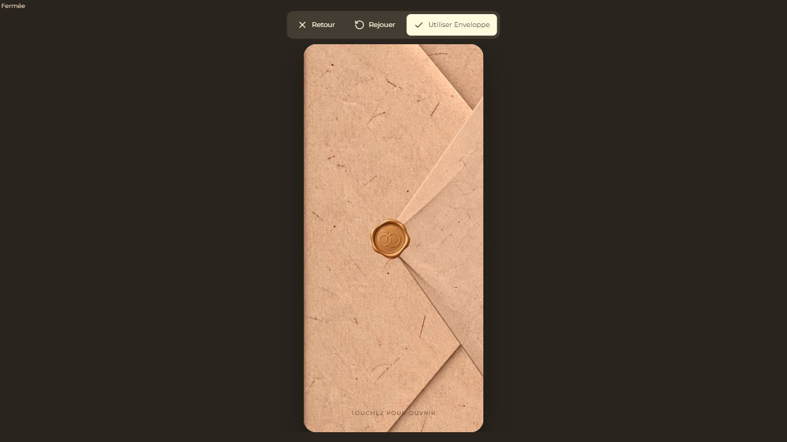
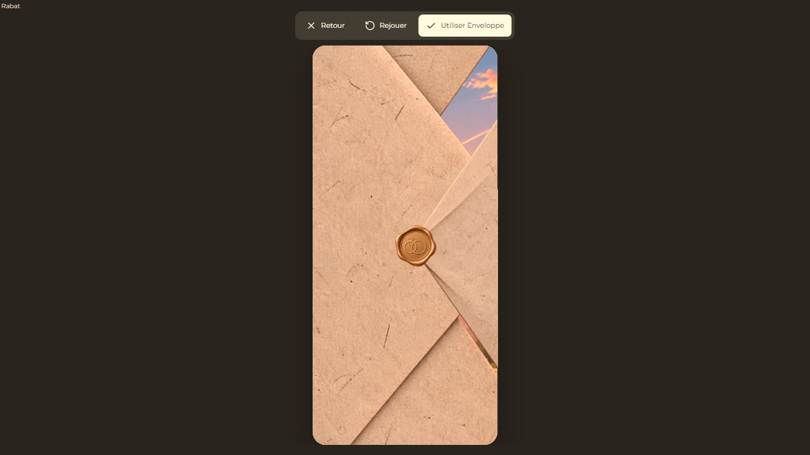
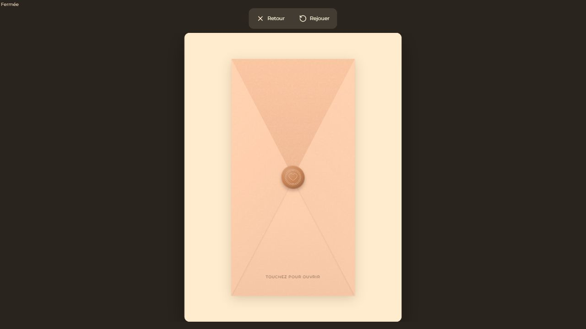
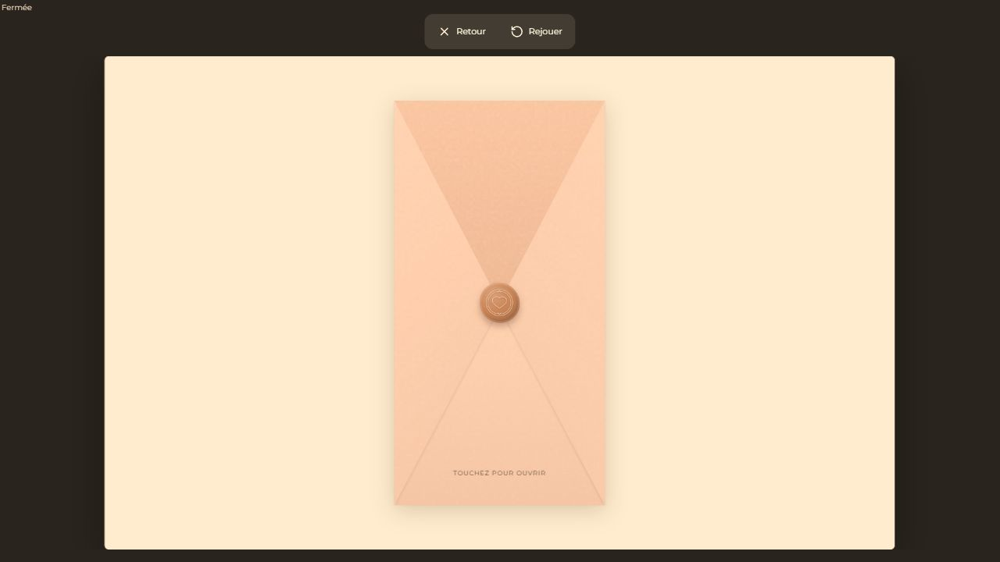

# Enveloppe PNG — Smartphone — 7 octobre 2026

## Résultat

L’enveloppe Smartphone utilise exclusivement `base1.png`, `rabat1.png` et
`cachet1.png`, copiés sans modifier leurs octets. Les deux parties coulissent
horizontalement ; le cachet est une image enfant du groupe du rabat droit.
Le document réel reste monté une seule fois, immobile derrière les PNG.
Aucune lettre miniature, rotation 3D, recolorisation, silhouette ou fragmentation.

Le schéma joint sert de référence pour le mouvement et la jonction. Ses couleurs
schématiques verte/rouge ne recolorent pas les fichiers : les PNG reçus sont
beige et doré. Le cachet visible est positionné à 48 % de la largeur du viewport,
au niveau de la pointe du rabat.

Les marges transparentes des fichiers sont compensées par le placement. Les
images gardent chacune leur ratio naturel. Le papier déborde du viewport pour
former une fermeture couvrante, sans déformation. Le recouvrement de la base
tient compte de son bord concave, afin de ne pas laisser de fente avant le clic.

## Architecture et fichiers

- `src/features/openings/animations/PngEnvelopeOpening.tsx` : nouveau renderer
  Smartphone, chargement, deux translations, guards de clic/fin, libération du contenu.
- `src/features/openings/pngEnvelopeLayout.ts` : URLs internes, dimensions,
  marges alpha, géométrie proportionnelle, déplacements et durée Smartphone.
- `src/features/openings/animations/ResponsiveEnvelopeOpening.tsx` : choix
  Smartphone PNG / ancienne animation Tablette et PC.
- `src/features/openings/registry/openingRegistry.ts` : branchement du dispatcher.
- `src/features/openings/openingTypes.ts` et `OpeningRenderer.tsx` : transmission
  du format explicite de Preview.
- `src/features/music/InvitationExperience.tsx` : transmission du device déjà
  résolu ; Public conserve sa détection automatique.
- `src/features/openings/OpeningProperties.tsx` : aperçu des PNG originaux,
  texte d’indication et durée propre au Smartphone.
- `src/styles.css` : viewport physique, calques, images, verrouillage puis
  libération du scroll, largeur stable lors de l’apparition d’une scrollbar classique.
- `public/assets/openings/envelope/{base1,rabat1,cachet1}.png` : fichiers originaux.
- `tests/png-envelope-opening.test.mjs` : 7 nouveaux tests, dont décodage alpha
  des PNG pour vérifier la couverture fermée.
- `tests/envelope-opening.browser.tsx` : fixture des renderers réels et mesures
  de continuité du document / position relative du cachet.

`VerticalEnvelopeOpening.tsx` et `envelopeSettings.ts` sont inchangés :
Tablette et PC gardent l’ancien rendu et leurs réglages.

## Timing et interaction

Durée globale par défaut : 1,1 s ; réglable de 0,9 à 1,2 s.
Le rabat + cachet démarrent 80 ms après la base ; easing `easeInOut`.
Le cachet n’a aucun animate/transition propre et conserve son opacité.
Le réglage facultatif `opening.customSettings.mobilePngDuration` est indépendant
de `opening.duration`, conservé pour Tablette et PC. Pas de migration.

Le premier clic déclenche une seule interaction ; les clics suivants sont ignorés.
Le document est `inert` avant la fin. À la fin, le calque PNG est démonté et
le document redevient interactif et scrollable. Rejouer remonte l’état fermé via
le mécanisme existant de Preview. Réduction de mouvement : translation courte
de 180 ms, sans retard.

Les images sont chargées avant de permettre l’ouverture. En cas d’erreur de
chargement, une indication permet quand même d’ouvrir le document.

## Vérifications réalisées

- SHA-256 des trois copies = SHA-256 des sources ; PNG RGBA inchangés.
- Ratios, placement et sortie complète du viewport : tests géométriques.
- Pas de fente avant clic : tests alpha sur 320×568, 375×812, 390×844 et 430×932.
- Preview Smartphone forcé depuis un navigateur PC : nouveau renderer PNG.
- Aperçu dédié de l’ouverture Smartphone : même renderer et même géométrie.
- Public responsive à 390×844 : même renderer PNG, device détecté automatiquement.
- Mesures à chaque frame : document identique, largeur et position stables,
  cachet attaché, translations uniquement horizontales, aucun overlay restant.
- Durées mesurées : environ 911 ms / 1110 ms / 1211 ms pour 0,9 / 1,1 / 1,2 s.
- Double-clic : `interact = 1`, `complete = 1` ; bouton du contenu ensuite
  cliquable (`action = 1`).
- Scroll Preview : `scrollTop = 426` après ouverture ; Rejouer remet à zéro
  et réaffiche le cachet fixé au rabat.
- Scroll Public : `window.scrollY = 377` après ouverture.
- Durée Smartphone 1,2 s sauvegardée/rechargée localement ; durée Tablette
  toujours 1,5 s.
- Preview Tablette et PC : ancien renderer confirmé visuellement et par le DOM.
- Aucune erreur ou warning dans la console de la fixture finale.
- Suite complète : **335 tests réussis, 0 échec, 0 ignoré**.
- **`npm run build` réussi**. Avertissement de taille du bundle (>500 Ko)
  toujours présent ; pas d’erreur TypeScript/Vite.

Ces vérifications utilisent l’application en local et son renderer Public réel,
pas un faire-part publié en production. Aucun déploiement, paiement, changement
de secret, écriture Supabase ou modification du contenu d’un projet utilisateur.
Souris et viewport Smartphone vérifiés ; pas de test physique sur téléphone tactile.

## Captures

