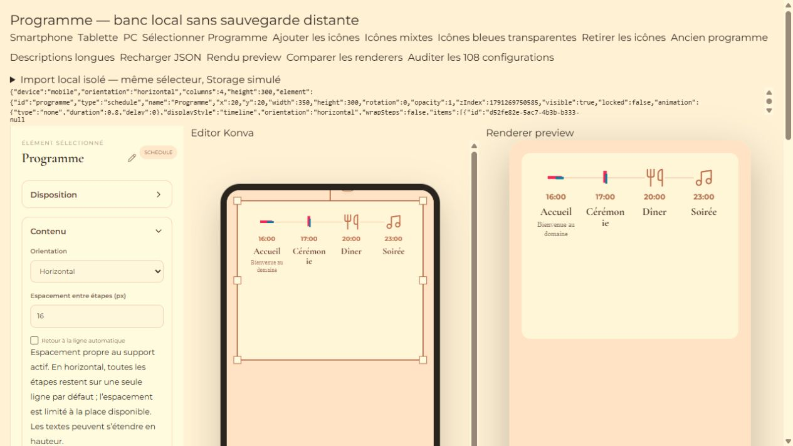
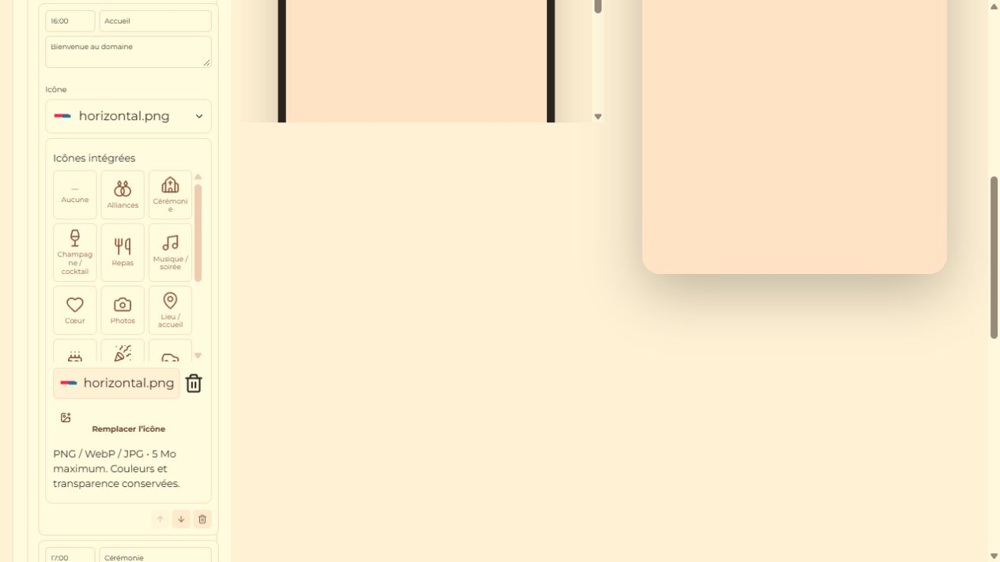
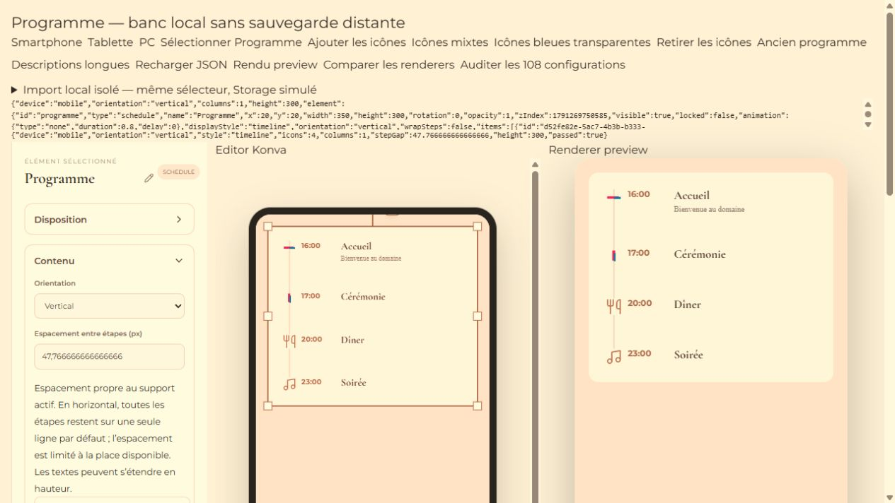

# Programme — icônes par étape

Implémentation locale du 6 octobre 2026. Aucun déploiement, paiement, changement de secret ni écriture Supabase de production.

## Fonctionnement

Dans **Programme > Contenu**, chaque étape possède un sélecteur compact : Aucune, 16 icônes vectorielles intégrées, icônes publiées de la bibliothèque générale, et import personnel. Les dessins sont partagés entre SVG et Konva ; aucune dépendance supplémentaire ni emoji.

Catalogue : alliances, cérémonie, champagne/cocktail, repas, musique, cœur, photos, lieu/accueil, gâteau, fête/danse, voiture, maison, cadeau, fleur, étoile, horloge.

Un import appartient uniquement à son étape. Miniature, remplacement, retrait et retour aux presets/Aucune sont disponibles. Le dernier import de l’étape est conservé en `customIcon` lorsqu’on choisit temporairement un preset ou Aucune, afin de pouvoir le réutiliser. Retirer l’import efface cette référence et son choix actif, sans toucher à l’heure, au titre ou à la description.

Le retrait/remplacement ne supprime pas physiquement l’ancien fichier Storage : cela préserve les autres références, copies du Programme et l’historique undo. La suppression physique n’est tentée que pour un nouvel upload qui n’a finalement pas pu être associé à l’étape, après le contrôle existant des références du projet.

## Données

```ts
type ProgramCustomIcon = {
  type: "custom";
  url: string;
  assetId?: string;
  name?: string;
  globalAssetId?: string;
};
type ProgramStepIcon =
  | { type: "preset"; name: string }
  | ProgramCustomIcon;

// Sur ScheduleItem :
icon?: ProgramStepIcon | string | null;
customIcon?: ProgramCustomIcon;

// Sur ScheduleElement :
iconSize?: number;
iconColor?: string;
```

Les anciennes chaînes d’ID sont toujours lues comme presets, sans migration destructive. Les nouvelles sélections utilisent l’union explicite. Taille globale du Programme configurable de 8 à 128 px, limitée à l’espace réellement disponible ; couleur/alpha des presets configurables, fallback sur l’accent actuel. Les images importées ne sont jamais recolorées.

## Import et Storage

- PNG, WebP et JPG/JPEG ; limite de **5 MiB**.
- Extension et MIME contrôlés ensemble. MIME vide/générique accepté uniquement avec une extension reconnue, puis normalisé avant upload.
- L’image doit également être décodable par le navigateur avant l’écriture.
- SVG refusé : le projet n’a pas de pipeline de sanitation SVG pour cet import.
- Bucket existant `wedding-assets`, chemin `{ownerId}/{projectId}/program-icons/{uuid}-{filename}`.
- Même repository, contrôle du propriétaire, policies et métadonnées `assets` que les autres imports du projet. [Documentation officielle de l’upload Storage](https://supabase.com/docs/reference/javascript/storage-from-upload).
- Erreur d’upload : aucune nouvelle icône sélectionnée. Échec de création des métadonnées : nettoyage du fichier qui vient d’être envoyé.

## Rendu et responsive

`getScheduleLayout` résout une seule géométrie utilisée par `ScheduleCanvasContent` et `ScheduleRenderer`. En vertical : icône à gauche de l’heure. En horizontal : au-dessus. Les PNG/WebP gardent couleurs, alpha et ratio : `contain` pour DOM et le même helper d’image pour Konva, sans crop ni fond imposé.

Smartphone/Tablette/PC utilisent leurs dimensions et espacements déjà enregistrés. L’horizontal reste sur une seule rangée par défaut ; les écarts excessifs sont plafonnés et la taille de l’icône s’adapte à la colonne. Le retour à la ligne reste une option volontaire existante. Le texte se répartit en hauteur sans chevauchement entre étapes.

## Templates et bibliothèque générale

Le handler `publish-template` existant parcourt récursivement les nouvelles propriétés, copie les URLs `wedding-assets` vers `template-assets/templates/{templateId}/...`, puis réécrit les URLs actives et mémorisées. Une même source n’est copiée qu’une fois. Une erreur de copie empêche la publication. Les URLs `global-assets` restent inchangées et ne sont pas copiées.

Le type `program_icon` est ajouté au frontend, au filtre admin **Icônes Programme** et à la version locale de `publish-global-asset`. Un import appartenant au projet propose l’action admin existante. Les fichiers globaux seront copiés dans `global-assets/program-icons/...` et le sélecteur utilise le cache partagé/invalidation existant.

**Aucune migration SQL nécessaire** : `global_assets.type` est déjà du texte libre. Pour activer la publication admin de ce nouveau type en production, il faudra déployer le frontend et la version locale mise à jour de `publish-global-asset` avec son contrôle JWT existant. Cela n’a pas été fait dans cette tâche. Après cette mise à jour initiale, enrichir le catalogue par des assets ne nécessite plus de redéployer le frontend.

## Vérifications réalisées

- Suite Node complète : **180 tests passés, 0 échec, 0 ignoré**. Dont 23 nouveaux tests ciblés sur les icônes : catalogue, normalisation, URLs, extension/MIME/taille, géométrie par orientation/device, ratio, import, erreurs et nettoyage, vrai store/duplication, vraie persistance locale, vraie normalisation/instanciation de template et handlers Edge réels avec dépendances simulées.
- Banc navigateur local : **108 configurations en Preview + 108 en Public**, comparées à Konva : 3 supports × 2 orientations × 3 styles × 3 modes d’icônes (aucune/presets/mixte) × 2 espacements. Coordonnées, dimensions, tailles, wrapping et sources des images contrôlés.
- Sélecteur réel : alliances et photo indépendantes, import PNG horizontal transparent, remplacement WebP vertical transparent, Aucune, reprise du dernier import, retrait, rechargement JSON ; textes inchangés.
- Taille configurable vérifiée dans l’UI ; couleur/alpha et taille des presets vérifiés via le banc local. Images custom non teintées.
- `npm run build` : **OK**. Avertissement Vite préexistant sur le bundle supérieur à 500 kB, non bloquant.
- `git diff --check` : OK. Console du banc navigateur : aucune erreur/warning.

Limites explicites : appels Storage/Auth/DB simulés pour les tests d’écriture et de publication ; aucun test réel d’upload, de publication globale ou de publication de template sur Supabase de production. Le renderer Public a été testé localement, pas sur un faire-part réellement publié.

Commandes :
```powershell
$env:PGLITE_MODULE_PATH='C:/Users/quent/AppData/Local/Temp/lbm-guest-pricing-audit-20261005/node_modules/@electric-sql/pglite/dist/index.js'
node --test tests/*.test.mjs
npm run build
```

## Fichiers de cette évolution

- `src/types/editor.ts`, `src/types/globalAssets.ts`
- `src/config/scheduleIcons.ts`
- `src/features/elements/programIconModel.ts`
- `src/features/elements/ProgramStepIconPicker.tsx`
- `src/features/elements/RichElementProperties.tsx`
- `src/features/elements/ScheduleIcon.tsx`
- `src/features/elements/ScheduleCanvasContent.tsx`
- `src/features/elements/ScheduleRenderer.tsx`
- `src/utils/scheduleLayout.ts`
- `src/services/programIconRepository.ts`, `src/services/assetRepository.ts`
- `src/pages/AdminAssetsPage.tsx`, `src/styles.css`
- `supabase/functions/_shared/programIconFormats.ts`
- `supabase/functions/publish-global-asset/index.ts`
- `tests/program-icons.test.mjs`, `tests/program-icon-upload.test.mjs`
- `tests/program-icon-edge.test.mjs`, `tests/program-icon-persistence.test.mjs`
- `tests/schedule.browser.tsx`, ce bilan et `docs/qa/20261006-programme-icons/`.

Les modifications précédentes d’orientation/espacement dans EditorCanvas, RichElementRenderer, les factories, le store et responsiveLayout sont conservées. `publish-template`, Stripe/RSVP, migrations, policies et secrets n’ont pas été modifiés.

## Captures du banc local






