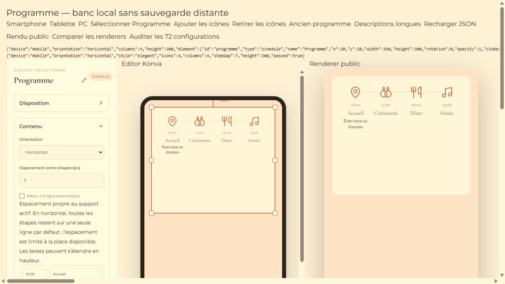
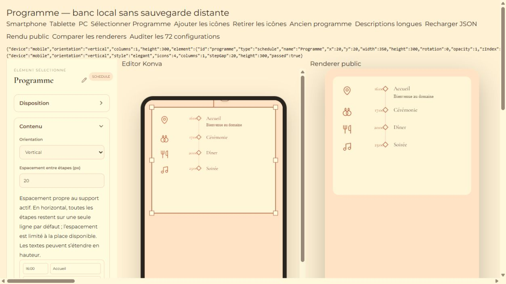

# Programme : orientation, icônes et espacement

Implémentation locale terminée le 6 octobre 2026. Aucun déploiement, aucune modification Supabase/Stripe/Netlify.

## Utilisation

Sélectionner le Programme, puis ouvrir **Contenu** dans le panneau de droite :

- **Orientation** : Vertical / Horizontal.
- **Espacement entre étapes (px)** : valeur libre, à partir de 0. Valider avec Entrée ou en quittant le champ. On peut vider le champ pendant la saisie sans modifier provisoirement le Programme.
- **Retour à la ligne automatique** : disponible en horizontal, décoché par défaut.
- Chaque étape conserve Heure, Titre, Description et possède un sélecteur **Icône** facultatif.

En horizontal, les étapes restent sur une seule rangée, même sur Smartphone. Les textes à l’intérieur d’une étape peuvent être répartis sur plusieurs lignes. Le réglage concerne le vide entre les cellules des étapes, pas une distance fixe entre leurs centres. Les cellules partagent la largeur disponible. Si un écart demandé est trop grand, seul l’écart rendu est plafonné afin de ne pas faire sortir les étapes du bloc ; la valeur choisie reste enregistrée et pourra s’appliquer intégralement dans un bloc plus large.

En vertical, l’écart est le vide entre la fin d’une étape et le début de la suivante. Une hauteur de bloc plus grande ne redistribue pas cet écart une fois qu’il a été choisi.

L’espacement utilise les overrides responsive existants : Smartphone, Tablette et PC peuvent avoir des valeurs différentes. L’orientation, le choix de retour à la ligne et le contenu des étapes sont communs, comme les autres propriétés de contenu. Les tailles de police indépendantes déjà existantes restent disponibles dans **Style** ; elles peuvent aider à garder les titres courts sur une seule ligne dans un Programme étroit.

## Données et compatibilité

```ts
ScheduleElement {
  orientation?: "vertical" | "horizontal";
  wrapSteps?: boolean;
  stepGap?: number;
  items: Array<{
    id: string;
    time: string;
    title: string;
    description?: string;
    icon?: string;
  }>;
  responsive?: {
    tablet?: { stepGap?: number; /* layout existant */ };
    desktop?: { stepGap?: number; /* layout existant */ };
  };
}
```

- Ancienne orientation absente/inconnue : Vertical.
- Retour à la ligne absent : désactivé.
- Ancienne icône absente/inconnue : aucun dessin, pas d’espace d’icône inventé.
- Écart vertical absent : conservation de la distribution verticale historique tant qu’aucun écart n’est choisi. Les snapshots responsive figent les espacements hérités pour empêcher une modification Smartphone de contaminer les autres supports.
- Écart horizontal absent : 16 px, plafonné visuellement si nécessaire.
- Hauteur rendue : maximum entre la hauteur demandée et le minimum nécessaire au contenu. Ce calcul ne modifie pas le projet pendant le rendu et participe au calcul partagé de la hauteur du document.

## Icônes et rendu

Catalogue central de huit icônes : Alliances, Cérémonie, Cocktail, Repas, Musique/soirée, Cœur, Photos, Lieu/accueil. Sept dessins reprennent les tracés Lucide vérifiés dans la version installée ; les alliances sont un petit dessin vectoriel local. Pas d’emoji ni de nouvelle dépendance.

Même géométrie, mêmes retours à la ligne, mêmes chemins vectoriels pour Konva et DOM. Icône à gauche de l’heure en vertical, au-dessus en horizontal. Couleur issue de l’accent du Programme. Liste, Timeline et Timeline élégante sont prises en charge. Le rafraîchissement des polices existant déclenche aussi le recalcul du Programme.

## Fichiers modifiés ou créés

- `src/types/editor.ts` : orientation, retour à la ligne, espacement responsive.
- `src/config/scheduleIcons.ts` : catalogue vectoriel partagé.
- `src/utils/scheduleLayout.ts` : placement, wrapping, espacements, hauteur minimale.
- `src/utils/responsiveLayout.ts` : résolution, snapshots et reset de l’espacement ; hauteur effective.
- `src/stores/editorStore.ts` : espacement modifiable même lorsque seule la géométrie est verrouillée.
- `src/features/elements/elementFactories.ts` : defaults du nouveau Programme.
- `src/features/elements/RichElementProperties.tsx` : orientation, espacement, wrap optionnel, icônes par étape.
- `src/features/elements/ScheduleIcon.tsx` : SVG partagé.
- `src/features/elements/ScheduleCanvasContent.tsx` : contenu Konva.
- `src/features/elements/ScheduleRenderer.tsx` : rendu DOM Preview/Public.
- `src/features/elements/RichElementRenderer.tsx` : intégration du renderer DOM.
- `src/components/editor/EditorCanvas.tsx` : intégration Konva.
- `src/styles.css` : styles du Programme et du sélecteur d’icône.
- `tests/schedule-layout.test.mjs` : 31 tests Programme.
- `tests/schedule.browser.html`, `tests/schedule.browser.tsx` : banc local sans autosave distant utilisant les vrais composants.
- Ce rapport et les captures `docs/qa/20261006-programme/`.

## Vérifications réalisées

- 157 tests locaux de non-régression : tous réussis, aucun ignoré ; dont 31 tests Programme.
- 72 comparaisons Konva/Preview et 72 comparaisons Konva/Public : toutes réussies. Matrice : 3 supports × 2 orientations × 3 styles × avec/sans icônes × écarts 0/20 px. Vérification des coordonnées, dimensions, wrapping, tailles de police, présence des icônes et hauteur du bloc.
- Tests dans les vrais contrôles : choix des huit icônes et Aucune, ajout, suppression, réorganisation, choix de l’orientation, écart 0/7/20, retour à la ligne explicite, descriptions longues et rechargement JSON via le store réel.
- Vérification d’indépendance : Smartphone à 7 px et Tablette toujours à 20 px.
- Tests de limites : très petits blocs, grand écart plafonné, conservation de la valeur demandée après move/resize/sauvegarde, minimum de hauteur, anciens programmes et données incomplètes.
- Aucune erreur/warning dans la console du banc navigateur.
- `npm run build` : réussi. Avertissement Vite non bloquant sur la taille du bundle JavaScript (> 500 kB).

Les contrôles Public utilisent le vrai renderer en mode Public, **localement** ; aucune invitation de production n’a été publiée ni modifiée. La persistance vérifiée ici est le round-trip JSON et la normalisation du store, pas un aller-retour réseau Supabase.

## Captures du banc local

Horizontal Smartphone, écart 7 px, icônes et titres à 14 px :



Vertical Smartphone, écart 20 px :


