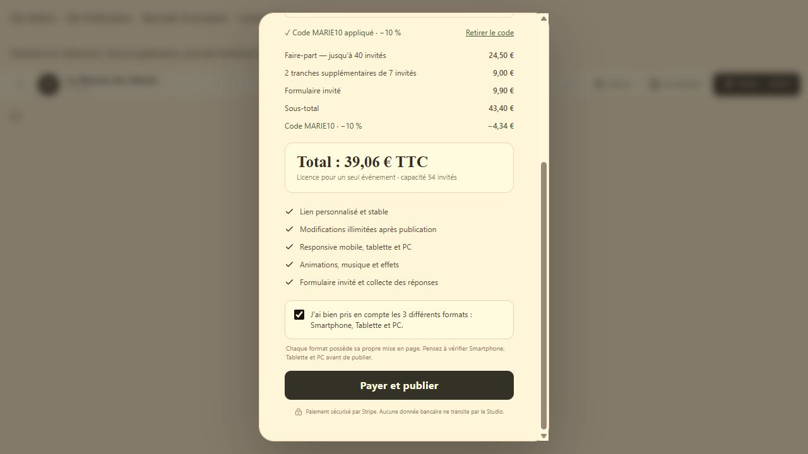

# Codes promo / partenaires — rapport du 7 octobre 2026

## État livré

Le système est implémenté. La migration et les trois Edge Functions sont déployées sur le projet Supabase existant `saaqgyjqecqbzizacvrp`. Les fichiers récupérés après déploiement correspondent exactement aux sources locales, y compris les helpers partagés.

Le frontend est prêt localement : **aucun déploiement Netlify n'a été effectué**. La page admin et le champ promo ne seront donc disponibles sur le site publié qu'après déploiement du frontend. Les modifications ne sont pas encore commitées ; HEAD de départ : `5ef9b64f76ed568868c08f4674815f1311ba6532`.

**Aucun vrai paiement, aucune session Checkout live, aucune modification des secrets Stripe.** Les essais Stripe utilisent des mocks ; les essais SQL sur Supabase sont transactionnels avec ROLLBACK. Aucun code promo commercial n'a été créé pendant les tests.

## Migration et déploiements

Migration locale créée avec la CLI : `supabase/migrations/20261007140545_promo_partner_codes.sql`.

Le connecteur Supabase a enregistré son application sous la version **`20261007143041`**, nom `promo_partner_codes`. Il s'agit de la même migration, pas de deux migrations à appliquer. Ne pas réappliquer la migration locale sur ce projet ; réconcilier ces versions dans l'historique CLI avant un prochain `db push`.

Ordre respecté : migration, webhook, validation, checkout.

| Fonction | Version | Statut | Protection |
| --- | --- | --- | --- |
| `stripe-webhook` | 16 | ACTIVE | Signature Stripe obligatoire ; JWT passerelle désactivé |
| `validate-promo-code` | 1 | ACTIVE | JWT passerelle et utilisateur authentifié non anonyme |
| `create-checkout-session` | 16 | ACTIVE | JWT passerelle, authentification et contrôle du propriétaire |

RPC : conservation de `reserve_guest_checkout(uuid,uuid,integer,text)` pour les anciens appels ; ajout de sa surcharge avec `p_promo_code text` ; mise à jour de `finalize_guest_checkout` et `finalize_project_payment`. Les RPC de réservation/finalisation/remboursement restent réservées au backend `service_role`.

## Structures finales

### `promo_codes`

```ts
{
  id: UUID;                         // PK
  code: string;                     // unique, trim + uppercase, 1–64 caractères
  discount_type: "percentage";
  discount_value: number;            // numeric(5,2), 1–90 %
  is_active: boolean;                // true par défaut
  created_at: timestamptz;
  updated_at: timestamptz;           // trigger à chaque modification
}
```

Index unique sur `code`, index `(is_active, created_at DESC)`.

### `promo_code_uses`

```ts
{
  id: UUID;                         // PK
  promo_code_id: UUID;               // FK promo_codes, suppression physique restreinte
  project_id: UUID;                  // snapshot historique
  user_id: UUID | null;              // snapshot historique
  stripe_checkout_session_id: string;// NOT NULL, unique
  stripe_payment_intent_id: string;  // NOT NULL, unique
  promo_code: string;                // nom au moment du checkout
  discount_value: number;            // taux au moment du checkout
  subtotal_amount: number;           // centimes entiers
  discount_amount: number;           // centimes entiers
  final_amount: number;              // centimes entiers
  created_at: timestamptz;
}
```

Contraintes : remise égale à l'arrondi du sous-total × taux / 100, total égal au sous-total moins remise, montant final positif. Index sur promo, projet, utilisateur ; index uniques Session et PaymentIntent. Les IDs projet/utilisateur sont volontairement des snapshots, pour conserver l'audit après suppression d'un projet/compte.

`guest_license_payments` reçoit `promo_code_id`, `promo_code`, `discount_value`, `discount_amount` et `subtotal_amount` calculé. `project_payments` reçoit `discount_amount` et `form_amount_cents`. Les contraintes de prix sont adaptées sans modifier les montants historiques. Les remboursements conservent l'historique promo.

## RLS et non-admin

- Réutilisation du rôle existant via `private.is_admin()` : contrôle de `auth.users.raw_app_meta_data.role`, pas d'un rôle envoyé par le navigateur.
- Admin : SELECT/INSERT/UPDATE sur les codes, SELECT sur l'historique.
- Non-admin : aucune liste de codes, aucune création/modification/suppression, aucun accès à l'historique global.
- Aucune écriture navigateur sur `promo_code_uses`, y compris pour un admin ; aucune suppression physique navigateur.
- Validation uniquement par la fonction serveur, réponse minimale pour le code demandé.
- Route `/admin/promo-codes` protégée ; bouton « Gérer les codes promos » réservé aux admins.

Les tests RLS incluent un utilisateur normal, un anonyme et une tentative de faux rôle admin dans les claims : interdictions confirmées. Le changement de compte non-admin dans l'UI de production n'a pas été testé, puisque le nouveau frontend n'y est pas déployé.

## Validation, calcul et checkout

Le navigateur transmet uniquement `promoCode` en plus des paramètres habituels. La validation d'affichage ne fait pas autorité. Le checkout normalise et revalide le code, puis la réservation SQL le revalide sous verrou et recalcule le devis serveur.

La remise est réservée au **premier achat de publication**, sur capacité invités + formulaire initial éventuel. Aucune remise sur upgrade, achat ultérieur du formulaire ou nouvelle publication après achat. Les prix restent : 2 450 centimes jusqu'à 40 invités, 450 centimes par bloc supplémentaire de 7, formulaire 990 centimes.

Calcul : sous-total en centimes, remise arrondie au centime, total = sous-total − remise. Le helper JavaScript utilise un taux en points de base et SQL utilise une valeur numérique ; les arrondis concordent, y compris pour 33,33 %.

| Cas à 10 % | Sous-total | Remise | Total |
| --- | --- | --- | --- |
| 40 invités sans formulaire | 24,50 € | 2,45 € | 22,05 € |
| 40 invités avec formulaire | 34,40 € | 3,44 € | 30,96 € |
| 54 invités avec formulaire | 43,40 € | 4,34 € | 39,06 € |

Les montants/taux frontend falsifiés sont ignorés. Un code inconnu, désactivé ou devenu invalide entre validation et réservation refuse le checkout : « Ce code promo n'est plus disponible. »

Un devis Stripe avec promo utilise une ligne au montant net calculé, sans créer de Coupon/PromotionCode Stripe. Les checkouts sans promo conservent leur structure précédente. Une modification/retrait de code ou changement de taux ne réutilise pas un ancien devis en attente aux conditions différentes.

Metadata sur **Session et PaymentIntent** : `promo_code_id`, `promo_code`, `discount_type`, `discount_value`, `subtotal_amount`, `discount_amount`, `final_amount`. Elles sont comparées au devis stocké, pas utilisées comme source autonome du prix.

Un checkout déjà créé conserve son snapshot ; changer/désactiver le code ne réécrit pas ce contrat existant. Les nouveaux checkouts prennent immédiatement le nouveau taux ou refusent le code désactivé.

## Webhook et historique

Signature Stripe vérifiée et statut `paid` obligatoire, pour la completion classique comme asynchrone. La finalisation SQL enregistre droits et utilisation promo dans la même transaction. Aucune utilisation lors de la validation ou création du checkout.

Replay : une seule finalisation/utilisation grâce à l'état du reçu et aux contraintes uniques. Le nom/taux/montants historiques sont copiés depuis le devis payé ; renommer ou désactiver le code ne les modifie pas. Un remboursement retire les droits selon la logique existante et garde l'audit ; une completion tardive ne réactive pas un paiement remboursé.

## Gestion admin

Formulaire code + taux, création immédiate, tri des codes actifs par date décroissante. Clic ligne : remplissage et mode « Modifier le code ». Modification du taux ou du nom, validation des doublons, Annuler pour sortir de l'édition. Poubelle avec confirmation et `stopPropagation`, puis désactivation logique et disparition de la liste. Feedback et verrou anti-double requête. Page utilisable sur mobile/tablette/PC.

## Tests réalisés

- Suite locale complète : **424 tests réussis**, aucun échec ni test ignoré.
- Audit PostgreSQL local : **426 assertions**, ROLLBACK confirmé.
- Préflight puis audit sur la base Supabase migrée : **426 assertions** par audit, ROLLBACK confirmé ; lecture après audit : zéro code, zéro utilisation, zéro fixture persistante.
- Tarifs : neuf paliers, avec/sans formulaire, taux 1/10/33,33/90 %, arrondis, capacité achetée, droits et snapshots.
- Upgrades au tarif plein : 40 → 54 = 9 €, réduction du nombre d'invités sans perte de capacité ; formulaire ultérieur = 9,90 €.
- Régressions : anciens guest-v1 sans metadata promo, publications historiques 24,90/34,80 €, formulaire séparé et flows existants ; remboursements/replays.
- Handlers backend avec Stripe/Supabase simulés : validation, metadata Session/PI, fraude frontend, concurrence d'invalidation, devis en attente, statut non payé, replay et remboursement.
- UI réelle locale sur fixtures : création/normalisation, doublon, taux invalide, clic ligne, renommage/taux, Annuler, confirmation de suppression sans sélection, code supprimé invalide, application/retrait, les trois exemples de prix, checkbox de validation responsive toujours obligatoire, absence du champ promo sur upgrade.
- UI testée sur viewport 390 × 844, 768 × 1024 et desktop ; aucun débordement horizontal sur mobile/tablette.
- Gardes HTTP des fonctions réellement déployées : validation/checkout sans auth → 401 ; webhook sans signature → 400. Aucun appel Checkout Stripe.
- Sources de toutes les fonctions déployées récupérées et comparées : correspondance exacte.
- `npm run build` : **réussi** (TypeScript + Vite). Warning existant sur la taille du bundle > 500 kB, non bloquant.

**Non réalisé :** paiement Stripe réel/test, livraison signée réelle d'un événement Stripe et E2E sur le nouveau frontend de production. Ce rapport ne prétend pas les valider.

Première exécution du préflight : fixture RSVP manquant un montant explicite sur le schéma de production ; corrigée à 990 centimes, puis tous les audits passent. L'échec initial a été rollbacké et n'a laissé aucune table/fixture.

## Warnings Supabase

Aucun nouveau warning de sécurité lié aux tables/RPC promo. Les warnings préexistants restent : certaines fonctions historiques SECURITY DEFINER exécutables par anon/authenticated, protection des mots de passe compromis désactivée. Ils n'ont pas été modifiés hors périmètre. Références : [fonctions anon](https://supabase.com/docs/guides/database/database-linter?lint=0028_anon_security_definer_function_executable), [fonctions authenticated](https://supabase.com/docs/guides/database/database-linter?lint=0029_authenticated_security_definer_function_executable), [protection des mots de passe](https://supabase.com/docs/guides/auth/password-security#password-strength-and-leaked-password-protection).

L'audit performance retrouve des avertissements historiques d'index FK et de policies RLS. Les nouveaux index promo apparaissent en INFO « unused index », attendu sur des tables neuves/vides ; ils sont conservés.

## Fichiers ajoutés/modifiés

Frontend :

- `src/App.tsx`
- `src/pages/HomePage.tsx`
- `src/pages/AdminPromoCodesPage.tsx`
- `src/components/admin/PromoCodesManager.tsx`
- `src/components/toolbar/PromoCodeInput.tsx`
- `src/components/toolbar/TopToolbar.tsx`
- `src/config/promo.ts`
- `src/services/promoCodeRepository.ts`
- `src/services/projectRepository.ts`
- `src/stores/editorStore.ts`
- `src/styles.css`

Backend :

- `supabase/config.toml`
- `supabase/functions/_shared/promo.ts`
- `supabase/functions/_shared/guestPayment.ts`
- `supabase/functions/validate-promo-code/index.ts`
- `supabase/functions/create-checkout-session/index.ts`
- `supabase/functions/stripe-webhook/index.ts`
- `supabase/migrations/20261007140545_promo_partner_codes.sql`

Tests et preuve :

- `supabase/tests/promo_codes_rls_audit.sql`
- `tests/guest-pricing-sql.test.mjs`
- `tests/guest-checkout-webhook.test.mjs`
- `tests/promo-pricing.test.mjs`
- `tests/promo-codes.browser.html`
- `tests/promo-codes.browser.tsx`
- `docs/qa/20261007-promo-codes/admin-mobile.jpg`
- `docs/qa/20261007-promo-codes/checkout-54-form.jpg`
- Ce rapport.



## Conclusion

Le backend est techniquement prêt au regard des tests transactionnels et simulés, et actif sur Supabase. Le frontend est construit et vérifié localement, mais pas encore déployé. Un test Stripe en environnement test reste nécessaire pour confirmer le parcours de paiement réel et sa livraison webhook avant de revendiquer une validation end-to-end complète.
