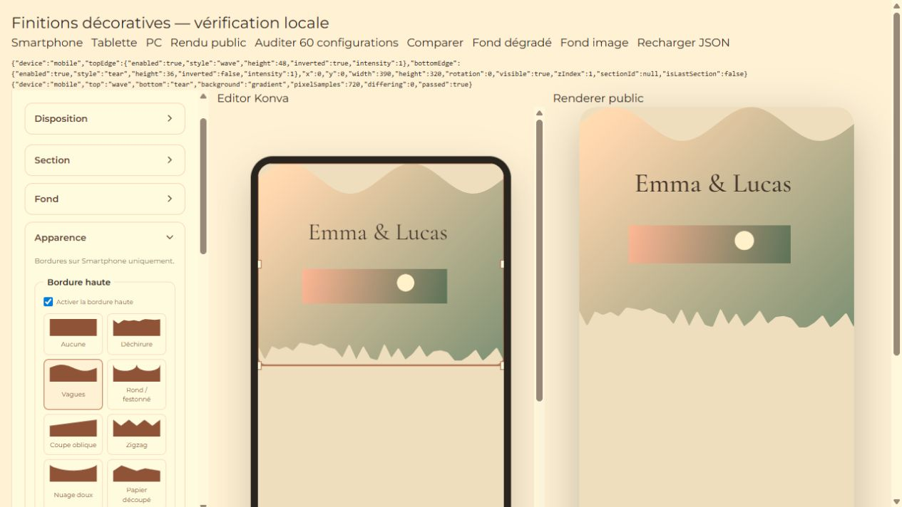
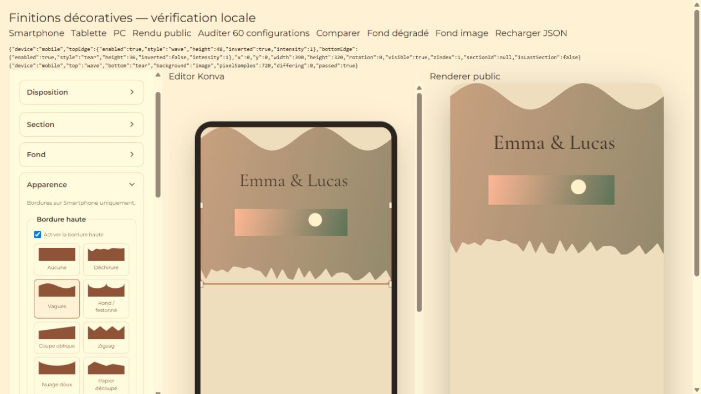

# Bordures décoratives de section — 6 octobre 2026

## Fonctionnement

Dans Section > Apparence, deux contrôles indépendants : Bordure haute et Bordure basse. Chacun propose activation, huit presets illustrés (Aucune, Déchirure, Vagues, Rond / festonné, Coupe oblique, Zigzag, Nuage doux, Papier découpé), hauteur, inversion et amplitude.

Les données sont `SectionElement.topEdge` et `bottomEdge`, avec `{ enabled, style, height, inverted, intensity }`. Les mêmes clés sont disponibles dans les layouts responsive existants. Une modification concerne uniquement le support actif ; la réinitialisation du support reprend les valeurs Smartphone comme les autres paramètres de layout.

Ancien projet : configuration absente = désactivée, style `none`. À l'activation initiale, hauteur 32 px et style déchirure. L'opacité reste celle du fond et de la Section : aucune seconde multiplication d'opacité n'est introduite.

## Rendu partagé

`sectionEdges.ts` génère une silhouette vectorielle déterministe dans les dimensions logiques de la Section. Konva et SVG utilisent exactement les mêmes points. Les coins arrondis sont conservés via un second clip. Couleur, dégradé, image et alpha sont découpés ensemble.

La surface Konva emploie un crop source pour l'image de fond : son nœud conserve les dimensions de la Section et n'agrandit pas le Transformer. Les gradients de Section partagent désormais les mêmes coordonnées dans Konva et SVG.

La découpe concerne seulement le fond. Les enfants restent dans le groupe existant, hors du clip : aucun texte, formulaire ou image contenu n'est coupé. Les éléments existants ne sont pas déplacés automatiquement. L'insertion d'un nouvel enfant réserve la hauteur décorative et le padding ; l'agrandissement existant de la Section tient compte de cette réserve basse.

Les découpes restent à l'intérieur de la boîte logique. Elles n'ajoutent ni espace externe, ni hauteur de document, ni déplacement de la Section suivante. Elles laissent apparaître le fond du document ; pour un raccord visuellement uniforme, ce fond peut être choisi comme celui de la Section suivante. Les hauteurs excessives sont limitées visuellement pour conserver un intérieur même sur une très petite Section.

## Vérifications réalisées

- Suite locale complète : **211 tests passés**, aucun échec ni test ignoré.
- Dont **31 nouveaux tests** : tous les styles et trois largeurs, indépendance haut/bas, inversion, amplitude, valeurs anciennes/invalides, responsive/reset, insertion et agrandissement, verrouillage, undo/redo, sauvegarde/rechargement locaux, duplication, snapshot de template.
- Navigateur local : **60 configurations Preview + 60 Public** comparées au fond Konva. Trois formats, quatre couples de bordures (sans bordure, déchirure basse, vague haute, festonné haut + oblique bas), cinq fonds (uni, uni avec alpha, dégradé linéaire, image, dégradé radial avec alpha). Comparaison de la géométrie, bounding box et grille de pixels RGBA incluant les pixels translucides : aucune différence supérieure à la tolérance sur les points échantillonnés.
- Commandes du vrai panneau : changement de style, hauteur 48 px, inversion, désactivation/réactivation, Aucune, retour Smartphone/Tablette, rechargement JSON, fond dégradé puis image. Bordure opposée et autres supports préservés.
- Texte et image contenus visibles ; aucune erreur ou warning dans la console de la fixture.
- `npm run build` : réussi. Warning Vite préexistant sur la taille du bundle (> 500 kB), non bloquant.

Ces tests utilisent les vrais renderers sur un projet de fixture local. Aucun projet de production, Storage ou service Supabase/Stripe n'a été modifié ; aucun déploiement réalisé. La sauvegarde/relecture est vérifiée localement, pas par une écriture réelle Supabase.

## Fichiers de cette modification

- `src/types/editor.ts`
- `src/utils/sectionEdges.ts` (nouveau)
- `src/utils/responsiveLayout.ts`
- `src/utils/sectionLayout.ts`
- `src/stores/editorStore.ts`
- `src/features/elements/SectionEdgeControls.tsx` (nouveau)
- `src/features/elements/SectionCanvasSurface.tsx` (nouveau)
- `src/features/elements/SectionSurface.tsx` (nouveau)
- `src/features/elements/RichElementProperties.tsx`
- `src/features/elements/RichElementRenderer.tsx`
- `src/components/editor/EditorCanvas.tsx`
- `src/styles.css`
- `tests/section-edges.test.mjs` (nouveau)
- `tests/section-edges-persistence.test.mjs` (nouveau)
- `tests/section-edges.browser.html` et `.tsx` (nouveaux)

Les modifications Programme et autres fichiers déjà présents dans le workspace ont été conservés.

## Captures

